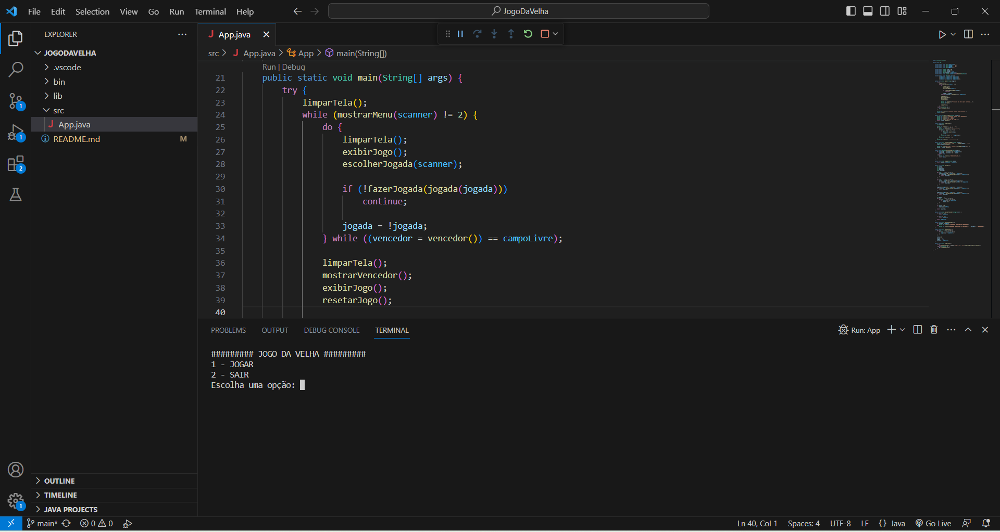
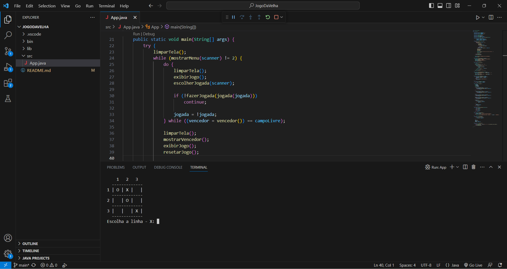
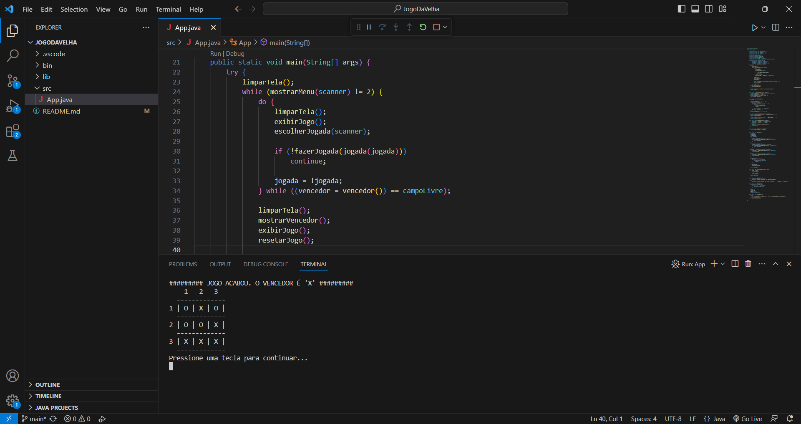

# Jogo da velha - Java

🎉 Bem-vindo(a) ao meu projeto de um jogo da velha desenvolvido em Java, onde dois usuários se enfrentam. O projeto foi desenvolvido apenas em back-end e pode ser utilizado diretamente no terminal. 
A matriz jogo é um array bidimensional que representa o tabuleiro do jogo da velha. Ele contém caracteres que podem ser ' ' (representando uma posição vazia), 'X' (representando o jogador 1) ou 'O' (representando o jogador 2). Cada posição do tabuleiro é referenciada pelo par de coordenadas (linha, coluna), onde linha e coluna variam de 1 a 3.
O código usa várias variáveis e constantes para controlar o estado do jogo. Por exemplo, jogada é uma variável booleana que indica qual jogador está prestes a jogar. vencedor é uma variável que armazena o vencedor do jogo ou o caractere campoLivre caso o jogo ainda não tenha sido concluído.

## Funcionalidades
- [x] Menu - Opção 1 = Jogar / Opção 2 = Sair;
- [x] Escolher jogada (linha e coluna);
- [x] Verificar se a jogada é válida (se o campo está vazio);
- [x] Realizar a jogada;
- [x] Verificar se teve um vencedor ou foi empate;
- [x] Mostrar quem foi o vencedor;
- [x] Limpar a tela e voltar para o inicio do programa;

## Tecnologia
- Java

# Abaixo segue o Readme criado automaticamente pelo VsCode que auxilia no uso do VsCode.

## Getting Started

Welcome to the VS Code Java world. Here is a guideline to help you get started to write Java code in Visual Studio Code.

## Folder Structure

The workspace contains two folders by default, where:

- `src`: the folder to maintain sources
- `lib`: the folder to maintain dependencies

Meanwhile, the compiled output files will be generated in the `bin` folder by default.

> If you want to customize the folder structure, open `.vscode/settings.json` and update the related settings there.

## Dependency Management

The `JAVA PROJECTS` view allows you to manage your dependencies. More details can be found [here](https://github.com/microsoft/vscode-java-dependency#manage-dependencies).
